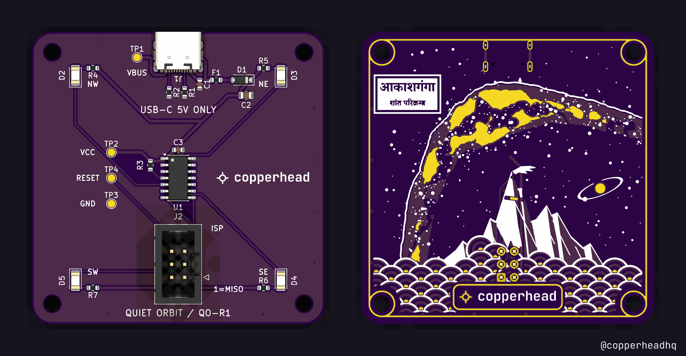
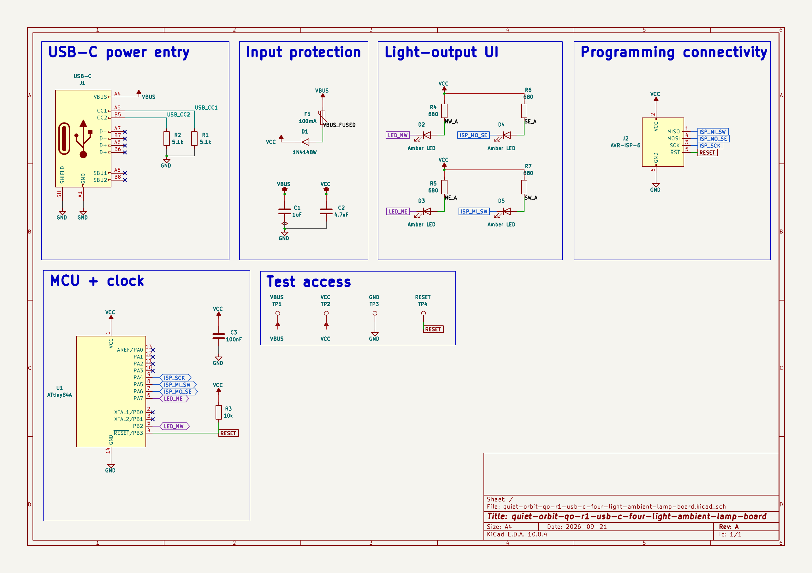

# Quiet Orbit QO-R1

A USB-C powered desk ornament: four amber LEDs at the corners of a 40 mm square, each on its
own hardware-PWM channel of an ATtiny84A, fading independently on four phases. 57 × 57 mm,
two layers, no data, no PD, no radio, no battery, no controls.

> ## ⚠ This board has never been built
>
> No PCB has been fabricated from these files. Nothing has been powered on. The firmware has
> never been compiled, because no AVR toolchain was available where it was written, and it has
> never run on hardware. Every manufacturer part number in the BOM is marked **UNVERIFIED** by its own
> author, and at least one fitted part is known to be the wrong choice.
>
> The files pass ERC and DRC. That means the copper is consistent with the schematic and with
> a set of design rules. It is not evidence that the circuit works.
>
> **Do not order this board expecting a working lamp.** Order it to look at, to fork, or to
> fix.



Quick facts: [docs/QO-R1-summary.pdf](docs/QO-R1-summary.pdf). Everything: [docs/QO-R1-reference.pdf](docs/QO-R1-reference.pdf).

## Background

On 21 September 2026, Paras Chopra [posted](https://x.com/paraschopra/status/2101906787050115492)
that he had asked an AI model he calls Astra to design a piece of hardware for itself. It chose
four softly blinking lights powered by USB, and produced a PCB, a casing and an email to a
manufacturer.

The same day we gave that post to [copperhead](https://x.com/copperheadhq) as a brief and
[shared the result](https://x.com/animeshsingh38/status/2102001126682042727). This repository is
that build, with its source files. It is an independent design that started from the public post. No files, images or schematics
from the original project are used here.

## The circuit

[](docs/schematic.pdf)

Full sheet as [PDF](docs/schematic.pdf) or [SVG](docs/schematic.svg). Source of truth is
`hardware/*.kicad_sch`. The exports are generated from it.

## Layout of this repository

```text
hardware/           KiCad 10 project: schematic, 57 × 57 mm board, design rules,
                    project footprint and symbol libraries
  variant-milkyway/ alternative back with Milky Way artwork in copper, mask and silk
firmware/           AVR-GCC, ATtiny84A, two 8-bit timers driving four PWM channels
docs/               summary and reference PDFs, specification, subsystems, pinout, BOM,
                    design decisions, changelog, and the schematic as PDF and SVG
fab/                gerbers, drill, BOM and CPL (read the warning in that folder)
images/             renders of the board, not photographs
3d/                 STEP, GLB and STL models, including one for an enclosure designer
LICENSES/           full text of the three licences below
```

## Building it

**Hardware.** Open `hardware/*.kicad_pro` in KiCad 10.0.4 or newer. The project carries its own
symbol cache and footprint libraries, so it opens standalone.

**Firmware.** Needs `avr-gcc` and `avr-libc`:

```bash
make -C firmware        # produces quiet-orbit-qo-r1.hex for attiny84 at F_CPU=8000000UL
```

This has never been run. If it does not compile, please send a patch.

Flash through J2 with any AVR ISP programmer. The ATtiny84A arrives blank and runs on its
internal 8 MHz RC oscillator. There is no crystal and no regulator. If your part ships with the
clock divided by 8, change that fuse; nothing else needs changing.

## Licence

Three licences, by file type:

| What | Licence |
|---|---|
| Hardware: everything under `hardware/`, `fab/` and `3d/` | **CERN-OHL-S-2.0** (strongly reciprocal) |
| Software: `firmware/` | **GPL-3.0-only** |
| Documentation and images: `docs/`, `images/`, `README.md` | **CC-BY-4.0** |

Full texts are in [`LICENSES/`](LICENSES/). In short: you may make, modify, sell and fabricate
this, and if you distribute a modified board or modified firmware you must publish your sources
under the same terms. See [`LICENSE`](LICENSE) for the per-directory statement.

**Trademarks are not licensed.** The copperhead word mark and the snake lockup that appear on
the silkscreen are trademarks; the licences above cover the design, not the marks. If you
fabricate a modified board, remove them from the silkscreen.

**No warranty.** This is an unbuilt, unverified design. CERN-OHL-S-2.0 sections 8 and 9 apply:
no warranty, no liability. If you fabricate it, that decision is yours.
